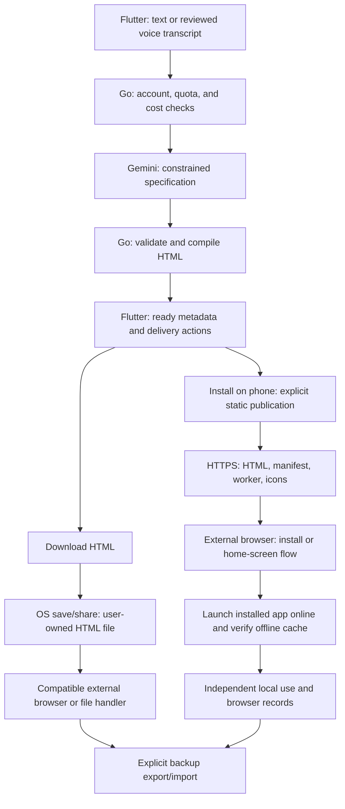

# herepp user journey: from Flutter prompt to an independent app

Date: 2026-09-10  
Status: illustrative planned experience, not a demonstration of implemented software. Browser installation, file delivery, and offline behavior require real-device validation before release.

This walkthrough complements [BLUEPRINT.md](BLUEPRINT.md) and [ROADMAP.md](ROADMAP.md). Flutter is the authoring and delivery interface only. The generated app never runs or renders inside Flutter.

## 1. Describe a tool in Flutter

A customer types:

> Make a reading log with book name, pages read, date, and total pages.

Alternatively, they tap the microphone, speak, review and correct the transcript, then press **Generate**. Finishing a recording does not automatically submit a request. The initial backend receives text, not raw audio; whether speech recognition itself uses a remote service depends on the device and recognizer.

Flutter sends the reviewed text to Go. Go checks the account and available quota, reserves the request and cost budget, then sends the prompt, system instructions, supported capabilities, and response schema to Gemini.

For a Free customer starting with three available requests, this successful creation leaves **two requests this week**. Re-downloading, installing, and using the resulting tool do not consume further AI requests. AI-assisted edits and follow-up clarification submissions follow the quota rules in the roadmap.

## 2. Go builds the completed app

Gemini returns a constrained definition, conceptually:

```text
Kind: logger
Title: Reading log
Fields: book name, pages read, date
Summary: total pages read
```

Go validates that definition, compiles it using the trusted HTML runtime, and applies the customer's verified logo, watermark, and advertising settings. The model does not supply arbitrary executable code or decide Premium eligibility.

Only after a completed artifact has passed its checks does Flutter show:

```text
Reading log — Ready
Record reading sessions and see your total pages.

[Download HTML]    [Install on phone]
```

This result is native text and actions in Flutter, not an HTML preview. These are separate delivery choices; the user can choose either or both.

## 3. Download HTML: save one portable file

Tapping **Download HTML** retrieves actual HTML bytes from Go through the authenticated download endpoint. Flutter verifies the completed download and opens the OS save/share flow. The user may need to choose a destination or confirm saving.

The resulting user-owned file is:

```text
reading-log.html
  Embedded interface, styles, JavaScript, assets, and tool definition
```

The customer opens it outside Flutter in a supported browser/file handler. Merely keeping it in Flutter's private cache is not successful portable delivery. Mobile file previews do not all execute HTML correctly; support must be verified per environment.

**Saving this HTML does not install a home-screen PWA.** File-mode work uses explicit backup export/import as its persistence baseline. The HTML cannot silently rewrite itself after every edit. A future portable-copy action would save a new snapshot file.

## 4. Install on phone: publish a static companion

The customer can select **Install on phone** directly, without first downloading the portable file. Flutter explains that this creates a hosted copy whose app definition is accessible to anyone with its URL. Publication is an explicit choice; the generated tool's personal records are not published.

Go builds and publishes the following package under a stable HTTPS address. These are illustrative paths, not a live deployment:

```text
/a/reading-log-123/
  index.html                 # Reading-log UI, styles, and local logic
  manifest.webmanifest       # App name, identity, start URL, and display settings
  sw.js                      # Trusted offline caching and update logic
  icons/
    icon-192.png
    icon-512.png
    apple-touch-icon.png
```

The hosted HTML uses the same validated tool definition and core runtime as the portable file, with a PWA-specific bootstrap. The download build does not depend on the hosted worker or installation assets.

Flutter opens the published URL in the **external browser**. The browser retrieves the page, manifest, icons, and worker automatically. Customers do not need to unpack a ZIP, upload files, or copy icons themselves.

Your static host retains this package for installation, recovery, and version updates under the disclosed hosting policy. Many app packages can share hosting infrastructure; each app does not require its own running server. Temporary private-download expiry must not remove a published PWA.

## 5. Complete browser installation

These are the primary phone examples. The roadmap maintains the broader browser matrix; menu wording and behavior require device verification.

**Android / Chrome:** open the HTTPS link, open the three-dot menu, choose **Install and create shortcut → Install**, and follow the device confirmation. Some versions use **Add to home screen → Install**. [Google's installation guide](https://support.google.com/chrome/answer/9658361?co=GENIE.Platform%3DAndroid&hl=en).

**iPhone / Safari:** open the HTTPS link, choose **Share** (sometimes under **More**), then **Add to Home Screen**, enable **Open as Web App** where offered, and tap **Add**. [Apple's installation guide](https://support.apple.com/guide/iphone/open-as-web-app-iphea86e5236/ios).

After adding the icon:

1. Open the new home-screen app while still online.
2. Let its worker finish preparing and verifying the required offline files.
3. Show **Ready offline** only after the installed app is controlled and the complete required cache is verified. This is a proposed herepp runtime status, not a browser-provided guarantee.
4. Test closing and reopening it in airplane mode.

A visible icon alone does not establish offline readiness. The service worker supplies cached responses after successful preparation. [Service-worker caching](https://developer.mozilla.org/en-US/docs/Web/API/Service_Worker_API/Using_Service_Workers).

On iPhone, do this preparation inside the installed app and preferably enter real records there. Safari's existing local records do not automatically transfer to the home-screen app; use explicit export/import if records were already created in the browser. WebKit documents that cookies can be copied at installation, but other local storage is not copied and ongoing website data is not shared. [WebKit's explanation](https://webkit.org/blog/14787/webkit-features-in-safari-17-2/).

## 6. Use the tool independently

The customer opens the **Reading log** icon and enters:

```text
Dune — 20 pages
Dune — 15 pages
Total: 35 pages
```

The installed app calculates the total locally and saves records in its browser database. **Saved on this device** appears only after the database transaction succeeds.

Flutter can be closed or uninstalled. Ordinary input, calculation, saving, and backup export require neither Flutter nor the authoring API or Gemini, and consume no creation quota. Static hosting can still receive initial-load and browser update-check requests; the design does not send reading records with those requests.

**Export backup** saves a separate file such as `reading-log-backup.json`. Clearing browser storage or losing the phone can lose local records. Hosting can restore the app code; restoring records requires a retained backup. A second phone or another recipient of the app link starts with its own records, with no automatic synchronization. Portable-file and PWA records also require explicit export/import to move between them.

## 7. Other concrete examples

| Customer request or choice | Planned result |
| --- | --- |
| Premium reading log with an uploaded logo | Go produces installation icons from the sanitized upload and omits the herepp watermark and static sponsor panel. Flutter ads are separately suppressed by the verified Premium entitlement. The download/install flow is otherwise the same. |
| “Convert kilometers to miles.” | A supported calculator follows the same delivery paths. Entering 10 km produces approximately 6.21 miles locally, without another AI request. |
| “Make a travel packing checklist.” | A supported checklist can be downloaded or installed; checking items and exporting a backup remain local operations. |
| “Make a calculator for my score.” | If the formula is missing, Flutter shows a clarification question. There is no runnable artifact until a supported definition is completed. |
| “Remind me every morning while the app is closed.” | The MVP returns an unsupported-capability explanation and offers a local checklist alternative. It does not deliver a file falsely claiming background reminder support. |

Existing paid clean artifacts retain their branding and ad settings after subscription cancellation. Upgrading does not rewrite old downloads: the customer rebuilds and downloads again, or publishes a compatible PWA update. A branding-only rebuild does not consume AI quota.

## 8. End-to-end handoff



Use this journey as an acceptance scenario: the customer's first reading session must happen outside Flutter; successful installation must be distinguished from saving a file and from offline readiness; and backup/restore must work without the authoring service.
